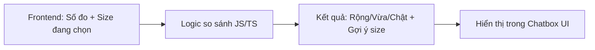
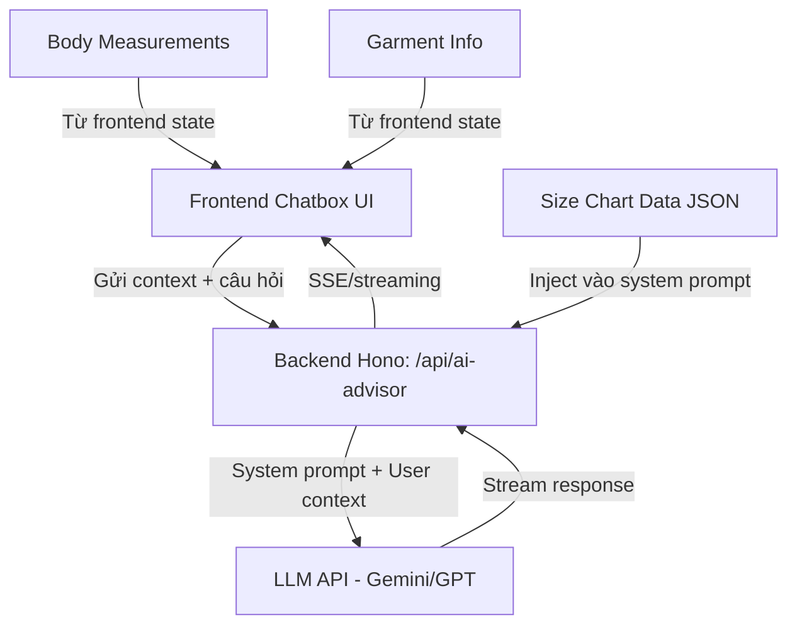
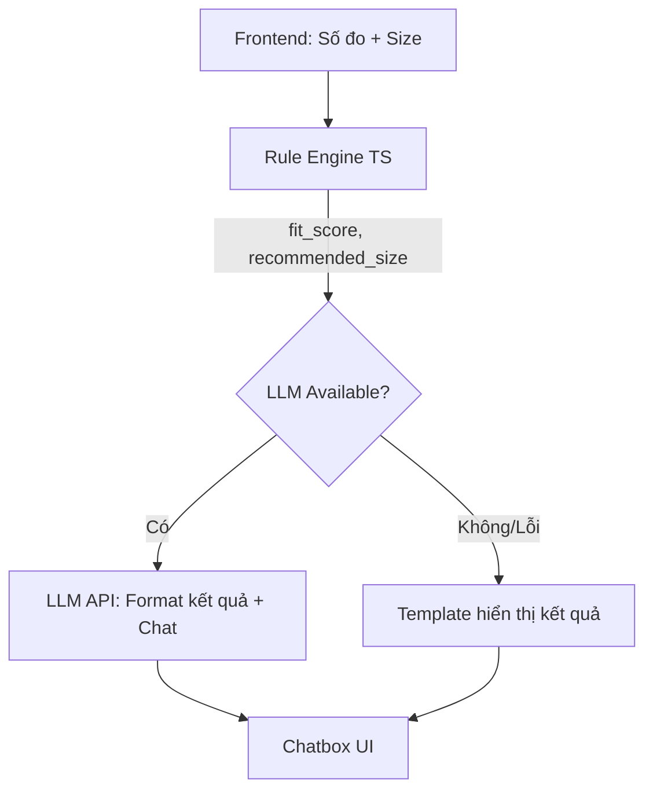

# AI Chatbox Tư Vấn Size Quần Áo — Phân Tích Các Hướng Đi

## Bối cảnh hiện tại

Hệ thống Fitting Room của bạn hiện có:

| Thành phần | Dữ liệu đang có |
|---|---|
| **Số đo cơ thể** | `shoulder`, `arm`, `bust`, `waist`, `hip`, `leg` (cm) + `height`, `weight` |
| **Thông tin áo** | `garment_type` (t-shirt, shirt, pant, short-pant), `size` (XS→XXL), `color` |
| **Backend SMPL** | Chuyển đổi body measurements → β vector → 3D mesh |
| **TailorNet** | Render áo lên model 3D, có γ vector encode size áo |
| **Frontend** | 3D viewer tương tác, panel chọn đồ + panel nhập số đo |

**Mục tiêu:** Tạo AI chatbox đánh giá áo **rộng/vừa/chật** so với số đo cơ thể, và **gợi ý size phù hợp**.

---

## 3 Hướng Đi Khả Thi

---

### 🔵 Hướng 1: Rule-Based (Bảng size + Logic cứng)

**Ý tưởng:** Xây dựng **bảng quy đổi size** dựa trên các khoảng số đo cơ thể, rồi so sánh trực tiếp với size người dùng đang chọn.

#### Cách hoạt động

```
Số đo cơ thể người dùng (bust=96cm, waist=82cm, ...)
        ↓
Tra bảng size chart → "Thân hình bạn phù hợp size L"
        ↓
So sánh với size đang chọn (M)
        ↓
Kết luận: "Size M sẽ hơi chật, nên lên size L"
```

#### Bảng size mẫu (áo nam)

| Số đo | XS | S | M | L | XL | XXL |
|---|---|---|---|---|---|---|
| Vòng ngực (cm) | 80-84 | 84-92 | 92-100 | 100-108 | 108-116 | 116-124 |
| Vòng eo (cm) | 64-68 | 68-76 | 76-84 | 84-92 | 92-100 | 100-108 |
| Bề ngang vai (cm) | 38-40 | 40-43 | 43-46 | 46-49 | 49-52 | 52-55 |

#### Ưu điểm
- ✅ **Đơn giản nhất**, triển khai nhanh (1-2 ngày)
- ✅ **Không cần API key**, không tốn chi phí
- ✅ **Kết quả nhất quán**, dễ debug
- ✅ **Tốc độ phản hồi tức thì** (< 10ms)

#### Nhược điểm
- ❌ **Cứng nhắc**, khó xử lý edge cases (thân hình mất cân đối)
- ❌ **Không có "chat" tự nhiên**, chỉ hiển thị kết quả dạng template
- ❌ **Khó mở rộng** sang tư vấn phong cách, mix đồ
- ❌ **Cần maintain bảng size** cho từng loại áo/thương hiệu

#### Kiến trúc kỹ thuật



> [!TIP]
> **Phù hợp nếu:** Bạn muốn MVP nhanh, chỉ cần đánh giá rộng/chật đơn giản, không cần tương tác chat phức tạp.

---

### 🟢 Hướng 2: LLM API (Gemini / GPT / Claude)

**Ý tưởng:** Gửi số đo cơ thể + thông tin áo → LLM API → Nhận phản hồi tư vấn tự nhiên bằng tiếng Việt.

#### Cách hoạt động

```
1. Người dùng nhấn "Thử đồ" → render 3D xong
2. Tự động hoặc nhấn nút "Hỏi AI tư vấn"
3. Frontend gom context:
   - Số đo: bust=96, waist=82, shoulder=46, height=170, weight=65
   - Áo đang mặc: t-shirt, size M
   - Giới tính: Nam
4. Gửi prompt + context → LLM API (qua backend proxy)
5. LLM trả lời tự nhiên:
   "Với vòng ngực 96cm và vai 46cm, chiếc áo T-shirt size M (ngực 92-100cm)
    sẽ hơi ôm sát. Bạn nên thử size L để thoải mái hơn khi vận động.
    Nếu thích phong cách oversize, hãy chọn size XL."
6. Người dùng có thể hỏi tiếp: "Còn quần thì sao?"
```

#### Ưu điểm
- ✅ **Trả lời tự nhiên, mạch lạc** bằng tiếng Việt
- ✅ **Xử lý được câu hỏi follow-up** (chat multi-turn)
- ✅ **Linh hoạt** — có thể tư vấn phong cách, mix đồ, occasion
- ✅ **Dễ mở rộng** — thêm context (dữ liệu sản phẩm, review) mà không cần sửa logic
- ✅ **Trải nghiệm người dùng cao cấp**, ấn tượng

#### Nhược điểm
- ⚠️ **Tốn chi phí** API call (~$0.001-0.01/lần gọi tùy model)
- ⚠️ **Latency 1-3 giây** cho mỗi phản hồi (có thể stream để cải thiện UX)
- ⚠️ **Cần API key** (Gemini miễn phí tier thấp, GPT/Claude tính phí)
- ⚠️ **Kết quả có thể không nhất quán** giữa các lần gọi (cần prompt engineering kỹ)

#### Kiến trúc kỹ thuật



#### System Prompt mẫu

```
Bạn là chuyên gia tư vấn thời trang cho cửa hàng TMF.
Nhiệm vụ: Đánh giá mức độ vừa vặn (fit) của trang phục so với số đo cơ thể khách hàng.

BẢNG SIZE CHART (áo nam):
- S: ngực 84-92, eo 68-76, vai 40-43
- M: ngực 92-100, eo 76-84, vai 43-46
- L: ngực 100-108, eo 84-92, vai 46-49
- XL: ngực 108-116, eo 92-100, vai 49-52

QUY TẮC:
1. So sánh số đo cơ thể với khoảng size chart
2. Nếu số đo nằm ở biên trên → "hơi chật/ôm"
3. Nếu số đo nằm ở biên dưới → "hơi rộng"
4. Luôn gợi ý: size vừa vặn (slim fit) và size thoải mái (comfort fit)
5. Trả lời ngắn gọn, thân thiện, bằng tiếng Việt
```

#### Chi phí ước tính

| Provider | Model | Giá/1000 request | Free tier |
|---|---|---|---|
| **Google Gemini** | Gemini 2.0 Flash | ~$0.15 | 15 RPM miễn phí |
| **OpenAI** | GPT-4o-mini | ~$0.60 | Không |
| **Anthropic** | Claude Haiku | ~$1.00 | Không |

> [!IMPORTANT]
> **Đề xuất dùng Gemini 2.0 Flash** — miễn phí cho tier thấp, chất lượng tốt, hỗ trợ tiếng Việt.

---

### 🟡 Hướng 3: Hybrid (Rule-Based + LLM)

**Ý tưởng:** Kết hợp **logic cứng** cho phần đánh giá rộng/chật (chính xác, nhanh), rồi dùng **LLM** để "nói chuyện" tự nhiên và tư vấn nâng cao.

#### Cách hoạt động

```
1. Rule engine tính toán:
   - fit_score: -2 (rất chật) → 0 (vừa) → +2 (rất rộng)
   - recommended_size: "L"
   - comfort_size: "XL"
   
2. LLM nhận kết quả rule + context → viết phản hồi tự nhiên:
   "Với vòng ngực 96cm, chiếc áo M hơi ôm (fit score: -0.8/2).
    👉 Size vừa: L | Size thoải mái: XL
    Bạn muốn tôi phân tích thêm về quần không?"

3. Nếu LLM API lỗi/chậm → fallback hiển thị kết quả rule-based dạng template
```

#### Ưu điểm
- ✅ **Chính xác nhất** — phần core logic không phụ thuộc LLM
- ✅ **Trải nghiệm tốt** — LLM làm đẹp kết quả + xử lý follow-up
- ✅ **Có fallback** — nếu LLM lỗi, vẫn hiện kết quả
- ✅ **Tiết kiệm chi phí hơn Hướng 2** — LLM chỉ "trang trí", không phải tính toán

#### Nhược điểm
- ⚠️ **Phức tạp hơn** — cần maintain cả 2 hệ thống
- ⚠️ **Vẫn cần API key** cho phần LLM

#### Kiến trúc kỹ thuật



---

## So Sánh Tổng Quan

| Tiêu chí | 🔵 Rule-Based | 🟢 LLM API | 🟡 Hybrid |
|---|---|---|---|
| **Độ phức tạp** | ⭐ Thấp | ⭐⭐ Trung bình | ⭐⭐⭐ Cao |
| **Thời gian dev** | 1-2 ngày | 2-3 ngày | 3-5 ngày |
| **Chi phí vận hành** | $0 | ~$5-20/tháng | ~$3-10/tháng |
| **Trải nghiệm chat** | ❌ Template cứng | ✅ Tự nhiên | ✅ Tự nhiên |
| **Độ chính xác** | ✅ Nhất quán | ⚠️ Có thể sai | ✅ Nhất quán |
| **Khả năng mở rộng** | ❌ Khó | ✅ Dễ | ✅ Dễ |
| **Offline/No API** | ✅ Hoạt động | ❌ Cần internet | ⚠️ Fallback |
| **Latency** | <10ms | 1-3s | 10ms + 1-3s |

---

## Đề Xuất Lộ Trình

> [!IMPORTANT]
> **Khuyến nghị: Bắt đầu với Hướng 3 (Hybrid)**, vì nó cho bạn cả **sự chính xác** của rule-based lẫn **trải nghiệm cao cấp** của LLM.

### Phase 1: Rule Engine + Chatbox UI (1-2 ngày)
- Xây dựng **size chart database** cho từng loại quần áo
- Implement **fit scoring engine** trong TypeScript
- Tạo **Chatbox UI component** ở frontend (bên cạnh hoặc dưới 3D viewer)
- Hiển thị đánh giá dạng template

### Phase 2: Tích hợp LLM (1-2 ngày)
- Thêm endpoint `/api/ai-advisor` ở backend Hono
- Tích hợp **Gemini 2.0 Flash API** (miễn phí)
- Implement **streaming response** cho UX mượt
- System prompt với bảng size + context cơ thể

### Phase 3: Polish (1 ngày)
- Chat history (multi-turn)
- Quick-action buttons ("Gợi ý size khác", "Phân tích quần")
- Animations, typing indicator
- Error handling + fallback

---

## Cấu Trúc File Dự Kiến

```
frontend-next/src/
├── component/fittingroom/
│   ├── chatbox/
│   │   ├── AIChatbox.tsx          # [NEW] Component chatbox chính
│   │   ├── ChatMessage.tsx        # [NEW] Render từng tin nhắn
│   │   ├── QuickActions.tsx       # [NEW] Nút gợi ý nhanh
│   │   └── fitEngine.ts          # [NEW] Rule-based fit scoring
│   └── ...existing components

backend-hono/src/
├── routes/
│   └── ai-advisor.ts             # [NEW] Proxy endpoint cho LLM API
├── data/
│   └── size-charts.json          # [NEW] Bảng size chart
```

---

## Open Questions

> [!IMPORTANT]
> 1. **Bạn muốn chọn hướng nào?** (Rule-Based / LLM / Hybrid)
> 2. **Bạn đã có API key của provider nào chưa?** (Gemini, OpenAI, Claude?)
> 3. **Chatbox nên đặt ở đâu trong layout?** Có thể là:
>    - Panel mới bên dưới 3D viewer
>    - Floating button góc phải dưới (như Intercom)
>    - Tab mới trong panel phải (cùng panel thông số)
> 4. **Bảng size chart** — bạn có sẵn bảng size chuẩn của TMF chưa, hay dùng bảng size quốc tế?
